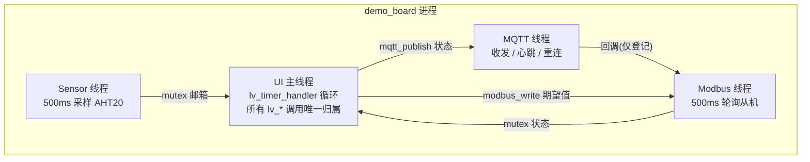
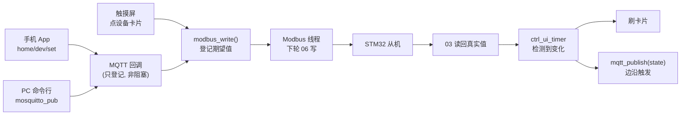

# 系统架构

## 总览

86 盒运行一个静态链接的 Linux 应用 `demo_board`（RV1106 / Buildroot / uClibc），内部 **1 个 UI 主线程 + 3 个后台线程**，通过 `/dev` 设备节点与硬件交互，通过网络与外部系统交互。



**核心原则：LVGL 线程不安全**——只有 UI 线程能调 `lv_*`；后台线程一律通过互斥锁保护的共享状态传递数据，UI 线程用 `lv_timer` 轮询读取并刷新控件。

## 线程职责

| 线程 | 创建入口 | 职责 | 与 UI 的数据通道 |
|---|---|---|---|
| UI 主线程 | `main()` | LVGL 主循环、触摸事件、所有界面刷新 | — |
| Sensor 线程 | `sensor_init()` | 轮询 AHT20（失败自动降级模拟数据） | `sensor_get()` + mutex 邮箱 |
| Modbus 线程 | `modbus_init()` | 轮询从机 03 读，消化期望值 06 写，掉线判定 | `modbus_get_*()` + mutex |
| MQTT 线程 | `mqtt_start()` | TCP 连接、报文收发、30s 心跳、3s 重连 | 下行回调 + `mqtt_publish()` |

## 初始化顺序（main.c）

```c
lv_init();
fbdev_init();                 /* /dev/fb0 */
evdev_init();                 /* /dev/input/event* */
setenv("TZ", "CST-8", 1);     /* 东八区 */
lv_disp_draw_buf_init(...);   /* 1/10 屏缓冲 */
lv_disp_drv_register(...);    /* 显示驱动先行, screen 尺寸依赖它 */

music_init();                 /* 扫描曲库 /userdata/music/ */
modbus_init("/dev/ttyS2", 9600);
mqtt_start(broker_ip, 1883, "luckfox86", "home/+/set");

lv_indev_drv_register(...);  /* 触摸驱动 */
ui_init();                    /* 必须在显示驱动之后, 否则段错误 */
sensor_init();
lv_timer_create(sensor_ui_timer, 500, NULL);

while (1) { lv_timer_handler(); usleep(5000); }
```

两个曾经翻车的顺序问题：

- `ui_init()` 提前调用（显示驱动未注册）→ 直接段错误
- `music_init()` 挪到 `ui_init()` 之后 → Home 页音乐卡片拿不到曲库

## 控制链路：三入口汇合



设计要点：

- **乐观更新**：点卡片本地立即变色，不等从机应答；从机回读真值与期望不符时以真值覆盖（掉线重连后自动纠正）
- **UI 事件回调里禁止阻塞**：WiFi 连接、音乐播放这类耗时操作必须 `pthread_create` 丢给后台，回调立刻返回，UI 状态靠 `lv_timer` 轮询
- **`modbus_write()` 是非阻塞登记**，不是同步写串口——MQTT 线程的回调里直接调它是安全的

## 显示管线

- `lv_conf.h`：`LV_COLOR_DEPTH 32`（与板子 32bpp framebuffer 一致）、`LV_MEM_SIZE 256KB`（Tab 视图 + 五页面控件的开销）
- 绘制缓冲 720×720/10 像素（全屏缓冲会触发 `lv_tlsf_malloc` 崩溃）
- tick 源：`custom_tick_get()`（`gettimeofday` 毫秒），不依赖任何平台库

## 持久化

`application/cfg.c`：key=value 文本存 `/userdata/smarthome.cfg`，写入走 `tmp + rename` 原子替换，断电不会写坏文件。已持久化键：

`volume / ac / light_liv / light_bed / curt_liv / curt_bed / set_temp / ac_mode / mqtt_ip`

开机恢复语义：**86 盒意志为准**——恢复后通过 Modbus 推给从机，覆盖从机自身状态。

## 部署形态

- `S99demo` init.d 脚本开机自启（Buildroot 无 systemd）
- `/sys/module/kernel/parameters/consoleblank` 置 0，防控制台息屏
- `/userdata/` 为可写分区，存放程序、曲库、配置
