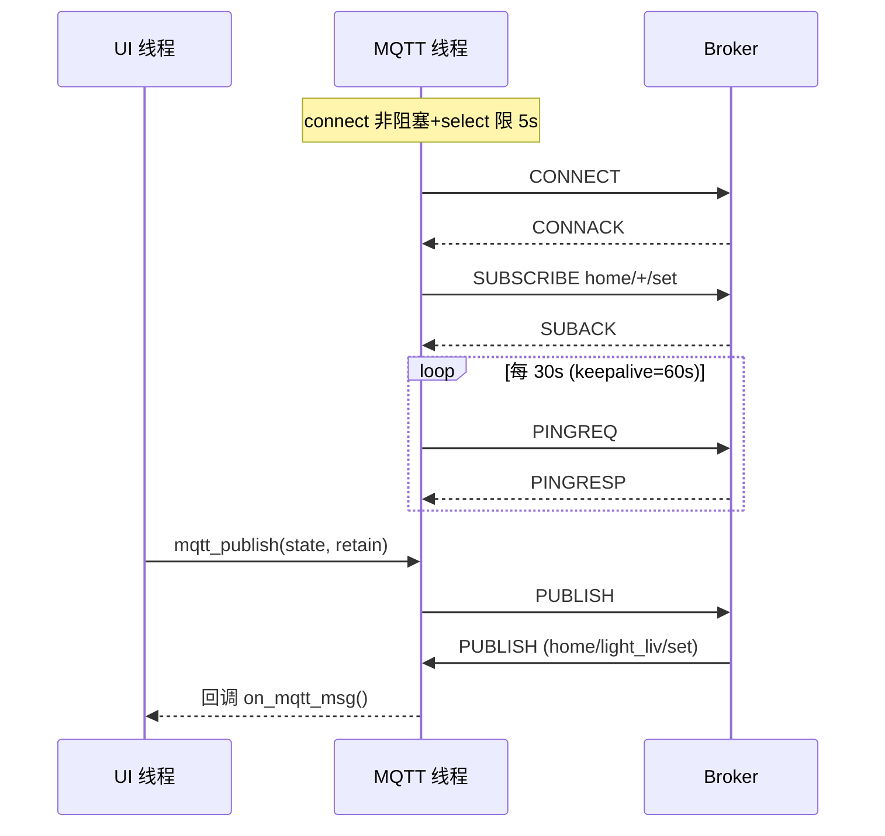

# MQTT 客户端（手写实现）

代码：`mqtt/mqtt.c/h`。不依赖 paho-mqtt 等任何库——从 TCP 裸 socket 起手，按 MQTT 3.1.1 规范手写全部报文。`mqtt/lessons/` 是配套的 Socket 基础练习（tcp_echo / tcp_client / udp_bcast），演进过程见 `docs/notes/socket-mqtt-notes.html`。

## 为什么手写

1. uClibc 交叉环境带 MQTT 库有额外移植成本
2. 嵌入式工程师需要吃透协议本身：报文结构、变长编码、心跳保活、会话语义
3. 排查能力：broker 踢连接、retain 不生效、重连风暴这类问题，手写过的人一眼定位

## 报文实现一览

| 报文 | 方向 | 关键实现点 |
|---|---|---|
| CONNECT | C→B | 可变头 + payload（clientId / clean session） |
| CONNACK | B→C | 校验返回码 0x00 才算连上 |
| SUBSCRIBE | C→B | **固定头低 4 位必须 0010**，错一个 bit broker 直接断连 |
| SUBACK | B→C | 校验 granted QoS |
| PUBLISH | 双向 | 剩余长度变长编码、retain 标志、QoS0 无应答 |
| PINGREQ / PINGRESP | C↔B | 心跳 |

### 剩余长度变长编码

每字节低 7 位有效，最高位是"还有后续"标志——最大 4 字节。读取侧要按字节循环解码，写侧要按数量级逆推。

## 线程模型

```c
mqtt_start(ip, 1883, "luckfox86", "home/+/set");
```



- **网络 IO 全部收敛在 MQTT 线程**；`mqtt_publish()` 用互斥锁保护 socket fd，UI 线程调用安全（内部非阻塞、不碰 `lv_*`）
- 连接超时：非阻塞 `connect()` + `select()` 5s——手机热点 DHCP 漂移时 SYN 被静默丢弃，阻塞式 connect 会干挂 2 分钟
- 重连：掉线后每 3s 重试，成功后重发 CONNECT + SUBSCRIBE

## 主题约定

| 主题 | 方向 | 说明 |
|---|---|---|
| `home/<dev>/set` | App → 板 | `light_liv / light_bed / curt_liv / curt_bed / ac` |
| `home/<dev>/state` | 板 → App | retain=1，App 重连后补收最新状态 |
| `home/86panel/temp` `hum` | 板 → App | 温湿度上报 |

`set` 进 `state` 出，主题分流**天然防回环**：板子不会收到自己上报的消息。板子订阅 `home/+/set`（`+` 单层通配，不会误收 `state`）。

## 下发链路（与本地触摸汇合）

```c
/* main.c — MQTT 回调的唯一职责 */
static void on_mqtt_msg(const char *topic, const char *payload)
{
    int on = (strcmp(payload, "1") == 0);
    if      (strcmp(topic, "home/light_liv/set") == 0) modbus_write(MB_REG_LIGHT_LIV, on);
    else if (...) /* 5 个设备逐一映射 */
}
```

回调**只做 modbus_write 登记**（非阻塞），不碰 UI、不碰串口——手机点灯与手指点卡片走完全相同的后半程：Modbus 线程下发 → 从机执行 → 回读真值 → `ctrl_ui_timer` 刷卡片 → 边沿触发上报。UI 代码零改动。

## 上报策略：边沿触发 + retain

- **边沿触发**：值变化才发，不周期广播，省流量
- **retain=1**：broker 保存最后一条，App 重连立即补状态
- **重连全景补报**：MQTT 线程离线→在线上升沿时，把全部设备状态各补发一遍（static `prev_mqtt` 边沿检测）——覆盖"开机时 broker 未就绪"和"断线期间的变更"两种场景
- 注意开机时不能直接发：`mqtt_start` 线程还没连上，消息会被丢弃，必须靠连接成功后的上升沿触发

## 联调工具链

```bash
# PC (broker 机)
mosquitto_sub -h 127.0.0.1 -t "home/#" -v      # 耳朵: 挂住看所有消息
mosquitto_pub -h 127.0.0.1 -t "home/light_liv/set" -m "1"   # 嘴: 模拟手机下发

# mosquitto 2.0 必须显式配置才能局域网接入:
#   listener 1883 0.0.0.0
#   allow_anonymous true
```

两个经典坑：

- **client_id 撞号**：手机 App 与板子用同一 ID，broker 踢旧连接 → "无限重连循环"。App 端 client ID 留空自动生成
- **sub 对 sub**：两个订阅者互相对望永远没消息——pub/sub 模型里消息只从发布者流向订阅者

## 手机 App 配置（IoT MQTT Panel）

连接 PC broker（热点 IP:1883），每个设备一个 Switch 控件：
- 发布主题 `home/<dev>/set`，订阅主题 `home/<dev>/state`
- 客户端 ID 留空（防与板子对踢）
- broker IP 存在 `/userdata/smarthome.cfg` 的 `mqtt_ip=` 行，热点 IP 漂移时改配置文件即可，无需重编译
